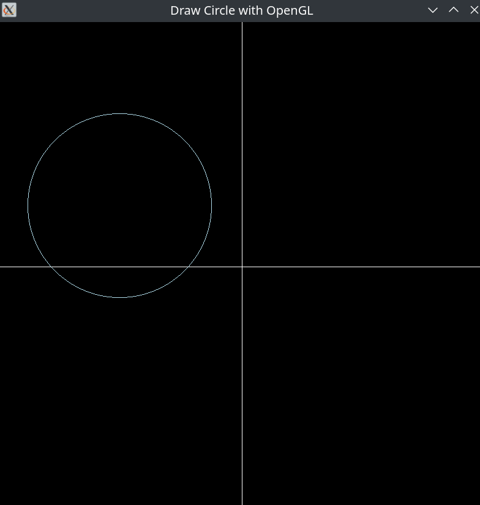
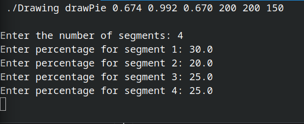
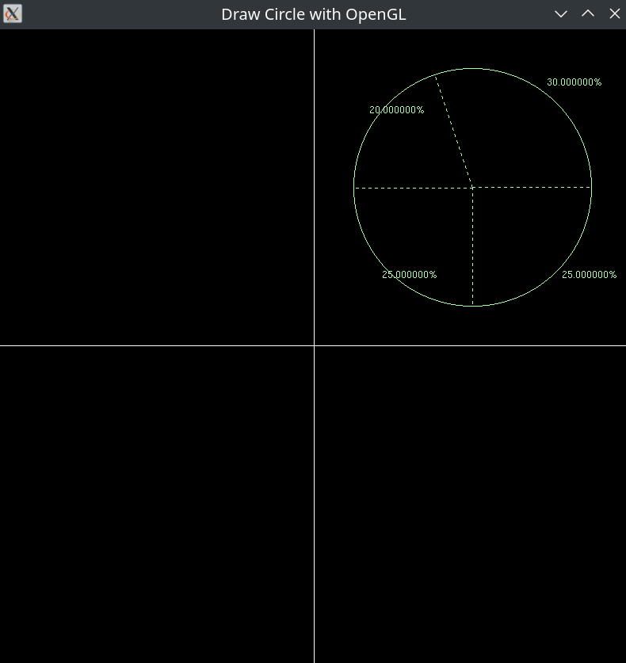
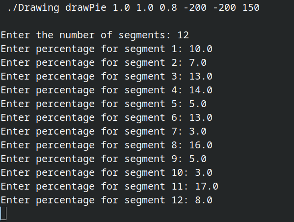
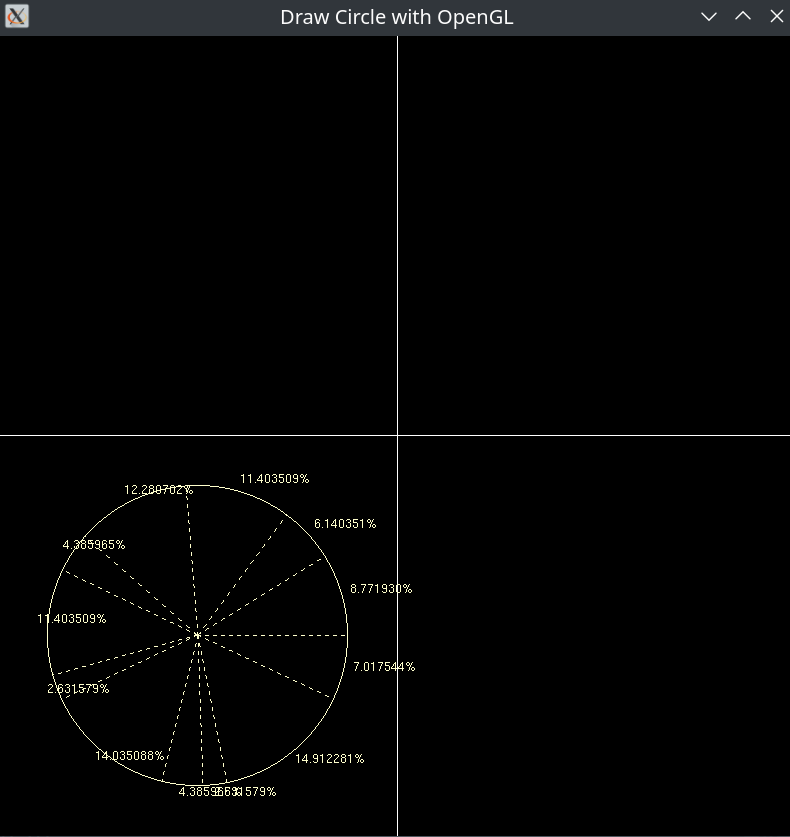

# Circle Visualization in OpenGL


By @ShinjiMC - Braulio Nayap Maldonado Casilla

## Introduction

This project demonstrates how to visualize circles using OpenGL in C++. The program can draw simple circles or pie charts representing percentage distributions. The background is set to black for better contrast with light colors used for the circles and pie charts.

## Compilation Instructions

To compile the project, follow these steps:

```bash
mkdir build
cd build
cmake ..
make
```

## Execution Instructions

Once compiled, you can execute the program with the following commands:

1. **Draw a Circle**

   **Command Structure:**

   ```sh
   ./Drawing drawCircle <r g b pointX pointY radius>
   ```

   **Example:**

   ```sh
   ./Drawing drawCircle 0.678 0.847 0.902 -200 100 150
   ```

   This command will draw a circle with a light blue color (`0.678 0.847 0.902`) at coordinates `(-200, 100)` with a radius of `150`.

   **Expected Output:**

   

2. **Draw a Pie Chart**

   **Command Structure:**

   ```sh
   ./Drawing drawPie <r g b pointX pointY radius>
   ```

   **Followed by Input for Percentages:**

   ```sh
   <number_of_segments>
   <percentage_1>
   <percentage_2>
   ...
   <percentage_n>
   ```

   **Examples:**

   - **Pie Chart with 4 Segments:**

     ```sh
     ./Drawing drawPie 0.674 0.992 0.670 200 200 150
     ```

     Then, input the following percentages:

     ```sh
     4
     30.0
     20.0
     25.0
     25.0
     ```

     
     **Expected Output:**

     

   - **Pie Chart with 12 Segments:**

     ```sh
     ./Drawing drawPie 1.0 1.0 0.8 -200 -200 150
     ```

     Then, input the following percentages:

     ```sh
     12
     10.0
     7.0
     13.0
     14.0
     5.0
     13.0
     3.0
     16.0
     5.0
     3.0
     17.0
     8.0
     ```

     
     **Expected Output:**

     

## License:

This project is licensed under [Creative Commons Atribución-NoComercial-CompartirIgual 4.0 Internacional](http://creativecommons.org/licenses/by-nc-sa/4.0/):

<a rel="license" href="http://creativecommons.org/licenses/by-nc-sa/4.0/">
  
</a>
